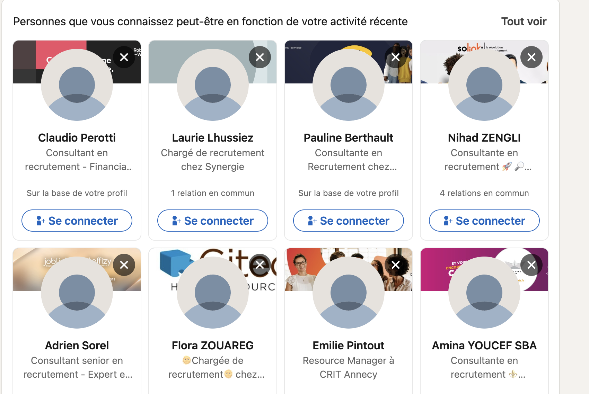
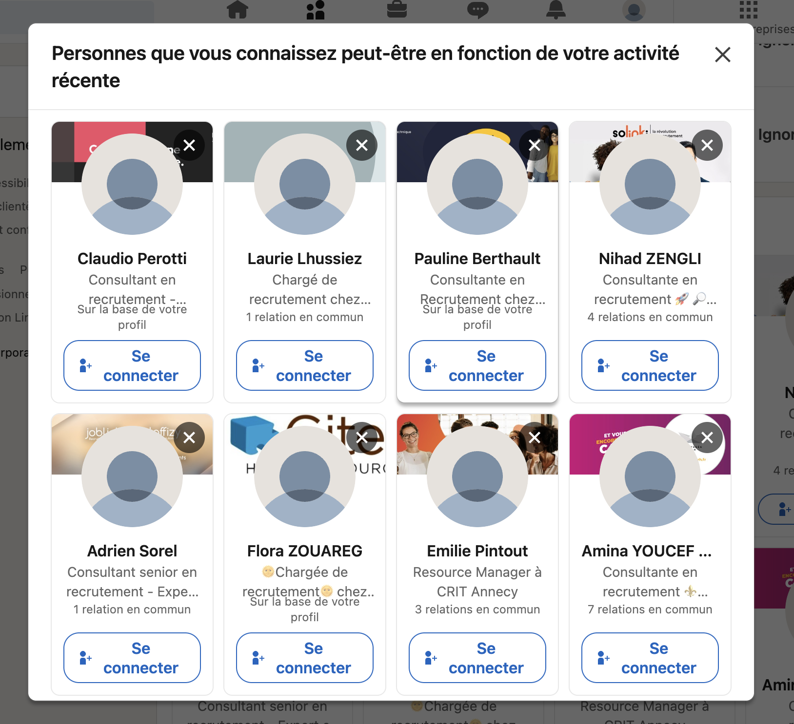

# LinkedIn Auto Connect Script

## Description

This script automates the process of sending connection requests on LinkedIn. It is designed to be executed in a browser environment (such as in the console of Chrome DevTools). The script repeatedly scrolls through the LinkedIn page, finds the "Se connecter" (Connect) buttons, and clicks on them to send connection requests. It also handles modals that may appear, such as warnings about reaching the weekly invitation limit.

## Features

- Automatically scrolls through the LinkedIn Discover page to load new profiles.
- Clicks on "Se connecter" (Connect) buttons to send connection requests.
- Handles modals to proceed with the automation smoothly.
- Stops the script when the weekly invitation limit is reached.

## How to Use

1. Change the language to French
2. Open LinkedIn and navigate to https://www.linkedin.com/mynetwork/grow/

   

   Click in the button "Tout voir"

   

3. Open the browser's Developer Tools (usually F12 or right-click and select "Inspect").
4. Go to the "Console" tab.
5. Copy and paste the entire script into the console and press Enter.
6. The script will start running and will send connection requests automatically.

## Script Explanation

### Function Definitions

#### `delay(ms)`

A helper function that returns a promise resolved after a specified number of milliseconds. Used to create pauses in the script.

`const delay = ms => new Promise(resolve => setTimeout(resolve, ms)); `

#### `clickIfExists(selector)`

Checks if an element exists for the given selector and clicks it if found.

```javascript
function clickIfExists(selector) {
  const element = document.querySelector(selector);
  if (element) {
    element.click();
  }
}
```

#### `handleLimitAlert()`

Handles the modal that appears when the weekly invitation limit is reached. If the limit is reached, it returns `true` to stop the script.

```javascript
async function handleLimitAlert() {
  const limitAlertSelector = ".artdeco-modal.ip-fuse-limit-alert";
  const limitReachedSelector = ".artdeco-modal__header h2";

  const limitAlert = document.querySelector(limitAlertSelector);
  if (limitAlert) {
    const headerText = limitAlert.querySelector(limitReachedSelector).innerText;
    if (
      headerText.includes(
        "Vous avez atteint la limite d’invitations hebdomadaire"
      )
    ) {
      console.log("Limite atteinte, fin du script");
      return true;
    }
  }
  return false;
}
```

#### `handleModal()`

Handles other general modals that may appear, clicking the OK button and the "See all" button if they exist.

```javascript
async function handleModal() {
  const modalSelector = ".artdeco-modal.ip-fuse-limit-alert";
  const okButtonSelector = ".artdeco-modal__actionbar .artdeco-button--primary";
  const seeAllButtonSelector = ".artdeco-button--tertiary.ph2";

  const modal = document.querySelector(modalSelector);
  if (modal) {
    clickIfExists(okButtonSelector);
    await delay(1000);
    clickIfExists(seeAllButtonSelector);
  }
}
```

#### `scrollAndWait()`

Scrolls to the bottom of the page and waits for new content to load.

```javascript
const scrollAndWait = async () => {
  const previousHeight = document.body.scrollHeight;
  window.scrollTo(0, previousHeight);

  let newHeight;
  do {
    await delay(2000);
    newHeight = document.body.scrollHeight;
  } while (newHeight === previousHeight);

  await delay(3000);
};
```

#### `processConnectButtons()`

Finds and clicks all "Se connecter" buttons in the container.

```javascript
const processConnectButtons = async () => {
  const container = document.querySelector(".discover-fluid-entity-list");
  if (!container) {
    console.error("Container not found.");
    return false;
  }

  const connectButtons = container.querySelectorAll(
    "button span.artdeco-button__text"
  );
  const connectButtonsArray = Array.from(connectButtons).filter(
    (button) => button.innerText === "Se connecter"
  );

  if (connectButtonsArray.length === 0) {
    console.log('No more "Se connecter" buttons found.');
    return false;
  }

  for (const button of connectButtonsArray) {
    const parentButton = button.closest("button");
    if (parentButton) {
      parentButton.click();
      connectionsMade++;
      console.log(
        `Connexion effectuée. Total des connexions : ${connectionsMade}`
      );
      await delay(2000);
    }
  }
  return true;
};
```

### Main Loop

The main loop continuously checks for the invitation limit, handles modals, processes connect buttons, and scrolls the page until the limit is reached or there are no more connect buttons to click.

```javascript
(async () => {
  let connectionsMade = 0;

  while (true) {
    try {
      const limitReached = await handleLimitAlert();
      if (limitReached) {
        break;
      }

      await handleModal();

      let buttonsProcessed = await processConnectButtons();

      if (!buttonsProcessed) {
        await scrollAndWait();
      }
    } catch (e) {
      console.error("An error occurred:", e);
      break;
    }
  }
})();
```

## Notes

- Ensure you use this script responsibly and adhere to LinkedIn's usage policies.
- The script is designed to run in the browser console and may require adjustments for different LinkedIn page layouts or updates.

## License

This project is licensed under the MIT License.
